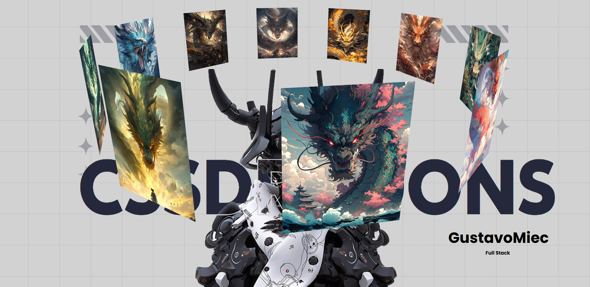

# 🐉 CSSDRAGONS

Um projeto em **HTML + CSS** que apresenta um carrossel 3D de dragões com rotação automática, acompanhado de uma seção de conteúdo estilizada com tipografia moderna e efeito visual de modelo.

## 📸 Demonstração

  

---

## 🚀 Tecnologias Utilizadas
- **HTML5**
- **CSS3 (Flexbox, Transforms, Animations)**
- **Fonts:**
  - [ICA Rubrik Black](https://www.cdnfonts.com/ica-rubrik-black.font)
  - [Poppins](https://fonts.google.com/specimen/Poppins)

---

## 📂 Estrutura do Projeto
```
/
├── index.html        # Estrutura principal
├── styles/
│   └── style.css     # Estilos do projeto
└── img/
    ├── bg.png        # Background principal
    ├── model.png     # Modelo em sobreposição
    ├── dragon_1.png  # Imagens do carrossel
    ├── dragon_2.png
    └── ... até dragon_10.png
```

---

## ✨ Funcionalidades
- 🎠 **Carrossel 3D automático** com rotação contínua (`@keyframes autoRotate`).
- 🎨 **Background quadriculado** com `repeating-linear-gradient`.
- 🔤 **Tipografia personalizada** com destaque no título (`h1`) e assinatura (`h2`).
- 👤 Área de autor com título e descrição.
- 🖼️ **Efeito de sobreposição** com imagem de modelo ao fundo.

---

## 🔧 Como Usar
1. Clone o repositório:
   ```bash
   git clone https://github.com/seu-usuario/cssdragons.git
   ```
2. Abra o arquivo `index.html` no navegador.
3. Certifique-se de que a pasta **img/** contenha todas as imagens (dragons, bg, model).

---

## 📌 Melhorias Futuras
- [ ] Adicionar **controles manuais** (setas ou arraste) ao carrossel.
- [ ] Implementar **responsividade total** para mobile.
- [ ] Inserir **efeitos sonoros/áudio ambiente** com dragões.
- [ ] Criar versão em **JavaScript** para interatividade avançada.

---

## 👨‍💻 Autor
**GustavoMiec**  
*Full Stack Developer*  

🔗 [GitHub](https://github.com/GustavoMiec)

